Probability Practice
====================

Part A
------

The expected number of random clickers = .3

65% of responders chose "Yes" & 35% of responders chose "No"

Let's assume that 100 people responded to the survey (to make it easy on
ourselves).  
That means the number of random/truthful clickers are:

    random_clicks = 100*.3
    truthful_clicks = 100-random_clicks

    ## There are 30 random clickers.

    ## There are 70 truthful clickers.

Given there is an even chance that the random clickers chose yes as that
they chose no, that means that 15 random clickers chose yes and 15
random clickers chose no. This can be used to calculate the total number
of truthful clickers that clicked "Yes" by simply subtracting 15 from
the total number of yeses (65 assuming 100 responses). Doing the math:

    Truthful_yes = 65-(random_clicks)*.5

    ## There are 50 truthful yeses.

Now, the fraction of people who are truthful clickers thatn answered yes
can be calculated by dividing the answer from above by the total number
of truthful clicks (70 in this case):

    Yes_proportion = Truthful_yes/truthful_clicks

    ## The proportion is: 0.7142857

Part B
------

This problem can be solved using Bayes Theorem, which says the
following:

P(B|A) = P(A|B)P(B) / \[P(A|B)P(B) + P(A|Bc)P(Bc)\]

Let's define the following:

-   Event A = Someone has tested positively for the disease  
-   Event B = Someone has disease

We know from the problem description that:

-   P(B) = .000025  
-   P(A|B) = .993  
-   P(Ac|Bc) = .9999

We need to find P(A|Bc) and P(Bc) to be able to calculate Bayes Theorem.
This can be done by subtracting P(Ac|Bc) and P(B) from 1:

    P_disease_negtest= 1-.9999
    P_nodisease= 1-.000025

    ## Probability of disease given negative test: 1e-04

    ## Probability of no disease: 0.999975

Next, calculate Probability of disease given a positive test
(P\_disease\_postest) using Bayes Theorem:

    P_disease_postest= (.993*.000025)/((.993*.000025)+(.0001*.999975))

    ## Probability disease given positive test: 0.1988824

##### This result implies that the test should not be given universally, as if it were, only 20% of people with a positive result would actually have the disease.

Green Buildings
===============

I was able to replicate the results of the staff member. The box plot
below shows that green buildings tend to have higher rents:

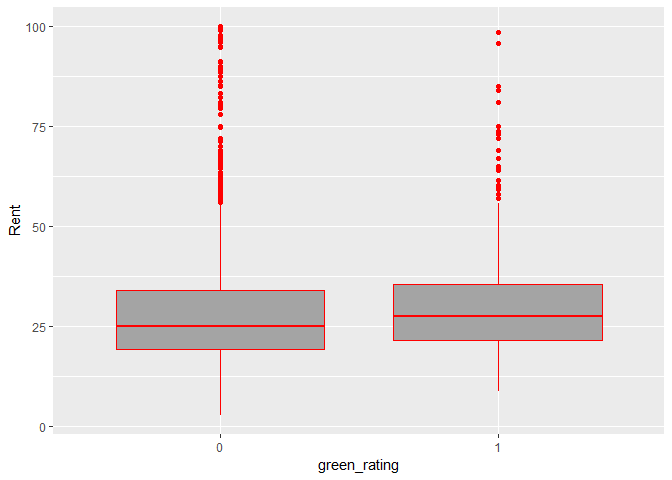

However, it could be that rents are just higher in certain areas and
those just happen to be areas that have green buildings. Let's adjust
for this by dividing each rent by the provided cluster rent. This will
give a better way to measure - we have the rent of a particular building
RELATIVE to other buildings in that area. Let's re-do the box-plot:

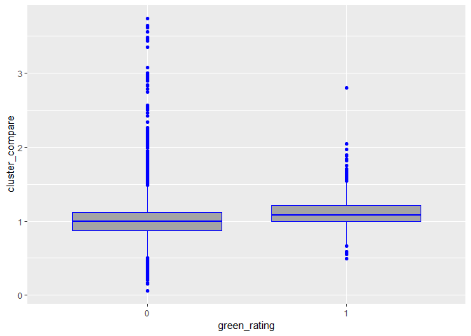

Still seems like green buildings have the advantage, but some additional
factors may be at play...Let's figure out the proportion of green
buildings that are class\_a & proportion of green buildings that have
amenities

    ## The proportion of green buildings that are class A is 0.7979502

    ## The proportion of green buildings that have amenities is 0.7291362

80% of green buildings are Class A! 73% of green buildings have
amenities. The box plots below shows that these features are also
correlated with higher rents. Perhaps that is the reason for the rent
boost, rather than the fact that the building is green:

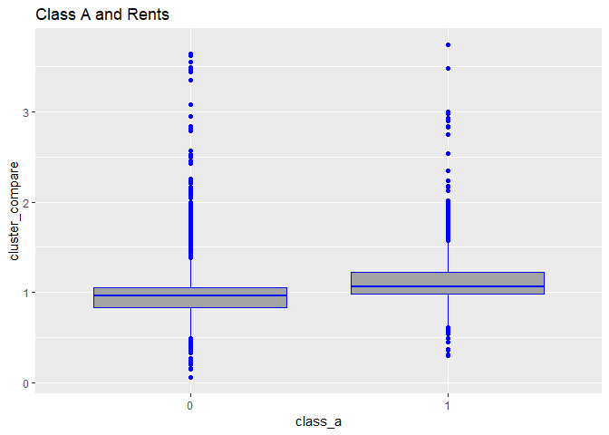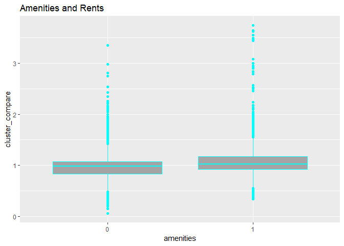

Let's shrink the data set to only compare nice green buildings with
amenities to nice non-green buildings with amenities

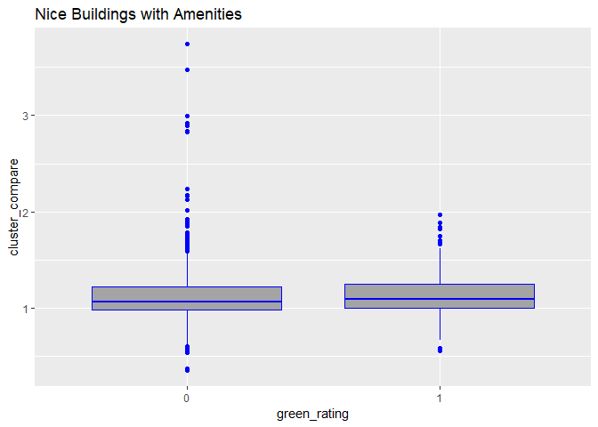

This still shows that green buildings have a slight advantage over
non-green, though the box plot shows there are some buildings that are
not green that have MUCH higher rents compared to others in their
cluser. Let's repeat the same exercise for non-nice buildings with
amenities, non-nice buildings without amenities and nice buildings
without amenities

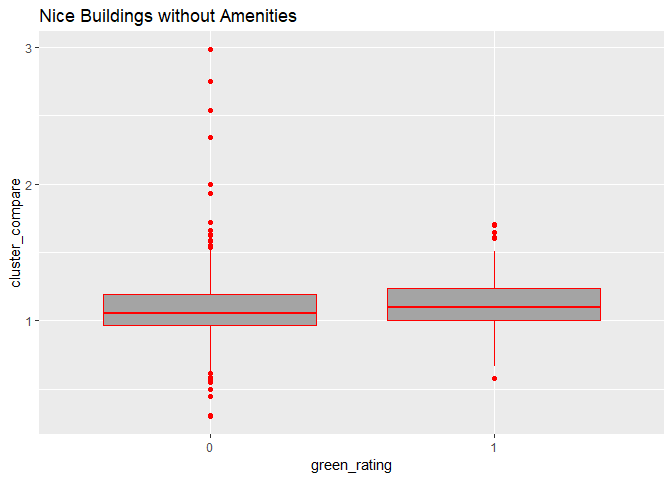

In this case (nice buildings without amenities) green buildings still
look like they have the advantage. Let's try Non-Nice buildings with
amenities

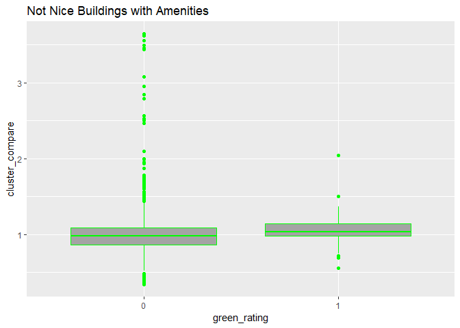

Green wins in this case as well. Finally let's try not nice buildings
without amenities

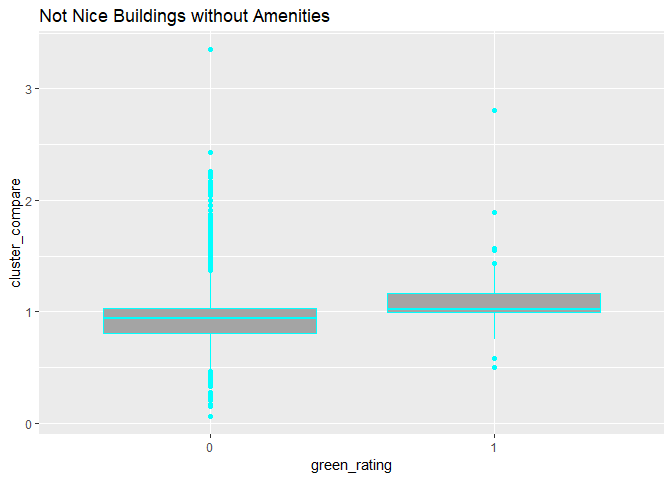

##### Green wins again! So it seems like there does seem to be an advantage to building a green building. The difference in expected rent would depend on the type of green building the developer ends up with, but how much and how quickly the investment could be paid off depends on the niceness of the building and if the developer plans to include amenities. Per my calculation, the builder should only expect an increase in rent compared to similar building types as follows:

-   2.82% increase for Class A buildings with amenities
-   4.30% increase for Class A buildings without amenities
-   5.34% increase for non-Class A buildings with amenities
-   8.08% increase for non-Class A buildings without amenities

##### It may seem from above that the builder should build the green non-Class A building without amenities. HOWEVER, this is not necessarily true - the percentage increase for these types of buildings is higher because the rent for them tends to be lower in general. In order to determine if the builder should make the investment in a green building, we would need to know rents for properties on East Ceasar Chaves for each of these 4 types. Then we could calculate out the monthly $ impact for each % increase and when the investment would pay off. Without that information, all we can say is that there appears to be an advantage for green buildings, but we don't know if the investment is worth it in this case.

Bootstrapping
=============

To figure out which of the specified indexes are the safest, and which
are the the most risky, first the close to close changes for each fund
was plotted over time:

Let's plot close to close returns of all funds on the same graph to to
get a relative sense of their variability:

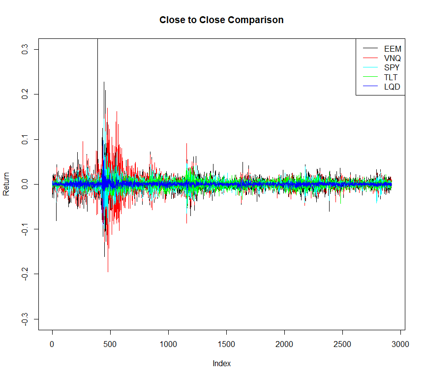

This plot is a little messy, but it does seem to show that returns from
Emerging Markets (EEM) and Real Estate (VNQ) are the most
rewarding/riskiest - we see the highest variability in returns, which US
Treasury Bonds (TLT) and Investment Grade Corporate Bonds (LQD) are our
safest investments (the least variablity in returns).

To further sense check this theory, let's take the average of the
absolute value of returns for each fund. The riskier funds should have
higher values and the safer funds should have lower values.

For further confirmation, the range of each variable will be calculated.
The range will show the maximum variability for each fund.

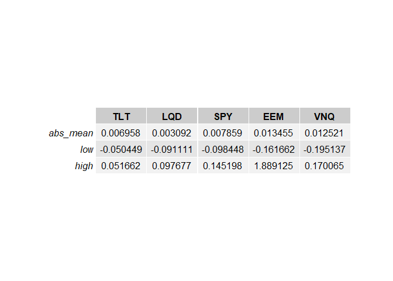

From the table above, it can be see that the assumptions determined from
the graph seem to hold true. EEM and VNQ have the highest absolute value
average return and the largest retrun ranges. TLT and LQD have the
lowest absolute mean values and smaller ranges - implying they are safer
investments. SPY looks to be somewhere in the middle.

As a result, the "safe" portfolio will have the following allocation:

-   35% allocation in TLT  
-   35% allocation in LQD  
-   30% allocation in SPY

The majority of the money is allocated in funds deemed "safe". The 30%
allocation in SPY is meant to keep some similarity between this
portfolio and the "aggressive" portfolio, which will have the following
allocation:

-   35% allocation in EEM  
-   35% allocation in VNQ  
-   30% allocation in SPY

The safe & aggressive portfolios will be compared to a portfolio where
there is an even 20% split between funds over a 4 week period. Using
bootstrap to simulate possibilities for each of these portfolios
produces the following VaR:

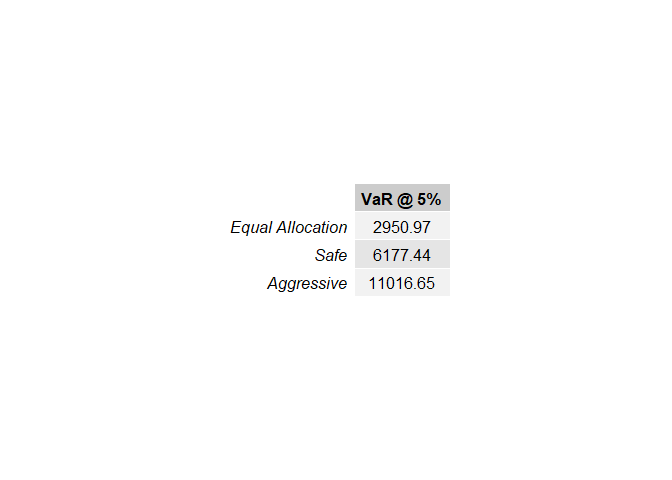

From the VaR, we can see that the risked loss is greatest for the
aggressive portfolio. However, the histogram of the generated PnL for
all simulations of each individual portfolio also have a story to tell
-- the aggressive portfolio also provides the greatest opportunity for
gain. High risk, high reward must be a saying for a reason! Or maybe -
no pain, no gain is more appropriate?:

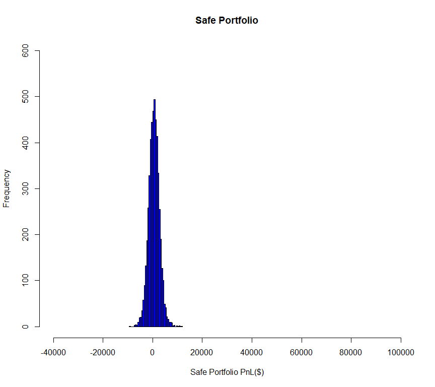

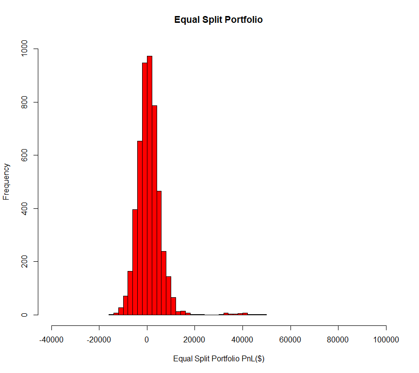

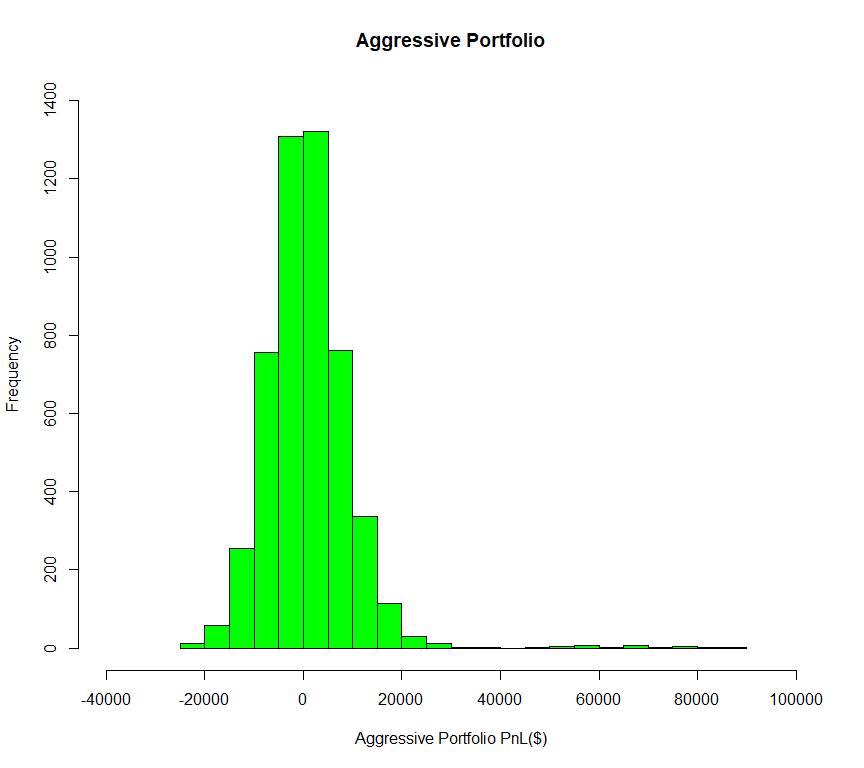

The safe portfolio produces a histogram where the bins are tight and
close to the center of the graph ($0 PnL) - showing that quite often the
returns for this portfolio hover around zero. The aggresive portfolio
has wide bins that are more spread out along the x-axis - showing more
variability in returns.

Market Segmentation
===================

For this problem, spam, adult, uncategorized & chatter were all removed
prior to starting - the assumption being that these particular items
would not help in determining people's preferences/types of people who
follow Nutrition H2O. (The assumption is that the "adult" tweets are
spam).

First, let's run PCA on the data. Let's split the users into 2 groups -
those that tweet a lot (&gt;50) and those that don't tweet a lot to see
if this brings any insights. Let's plot the results - including the
number of tweets category for each user

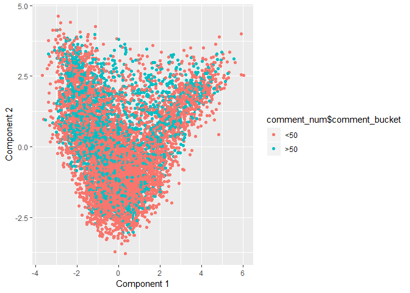

This plot isn't super helpful - the number of tweets people make don't
seem to give any good information about how PCA is separating people.
Perhaps we can see how the individual PCs are loaded on the original
variables, but printing the top categories associated with each
component:

-   First Component (positive)

<!-- -->

    ##  [1] "sports_fandom" "religion"      "parenting"     "food"         
    ##  [5] "school"        "family"        "automotive"    "news"         
    ##  [9] "politics"      "crafts"

\*First Component (negative)

    ##  [1] "shopping"         "college_uni"      "online_gaming"   
    ##  [4] "beauty"           "photo_sharing"    "outdoors"        
    ##  [7] "fashion"          "personal_fitness" "health_nutrition"
    ## [10] "cooking"

-   Second Component (positive)

<!-- -->

    ##  [1] "health_nutrition" "personal_fitness" "outdoors"        
    ##  [4] "food"             "religion"         "parenting"       
    ##  [7] "cooking"          "sports_fandom"    "school"          
    ## [10] "beauty"

-   Second Component (negative)

<!-- -->

    ##  [1] "computers"      "current_events" "news"           "online_gaming" 
    ##  [5] "shopping"       "photo_sharing"  "tv_film"        "college_uni"   
    ##  [9] "travel"         "politics"

It looks like PCA is separating in the first component by age -- the
resulting categories = religion, parenting, family, news, politics vs.
college\_uni, online\_gaming, photo\_sharing, personal\_fitness, etc.
The second component seems to indicate a separation b/t people who care
a lot about how they look/fitness vs. people who are interested in more
"academic" types of pursuits. Lets try giving some more scores based on
old v. young and jock v. nerd to see if the graph becomes more
meaningful ...

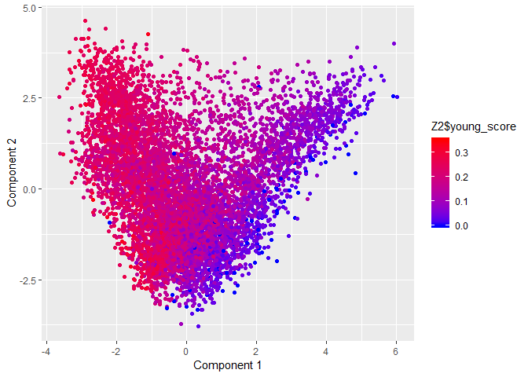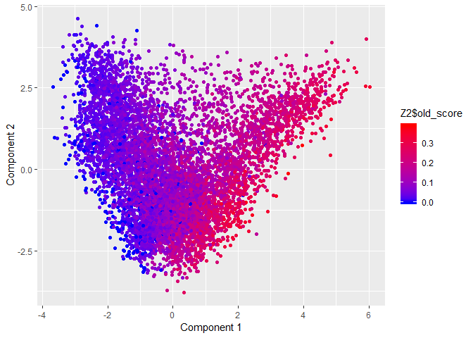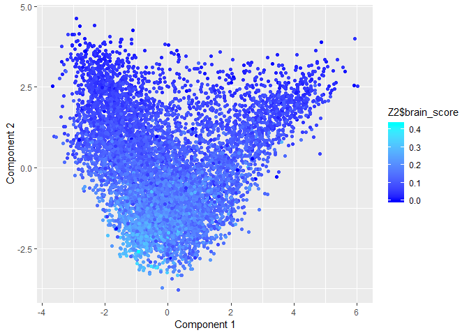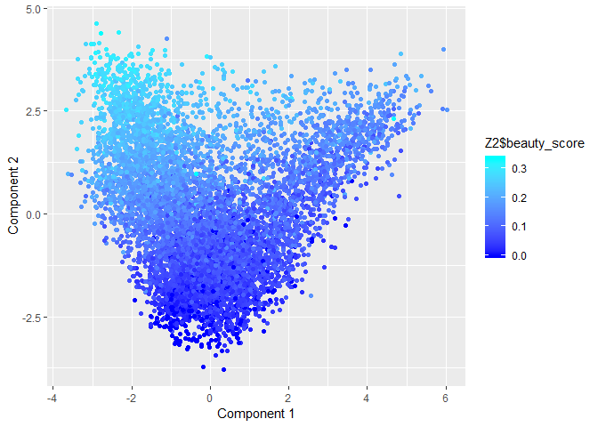

#### This seems to give more insight into the separation/groups PCA is putting Nutrition H2O followers into. It seems there is a segment of the population of followers that is younger - they tweet more about things that are traditionally associated with young adults (perhaps high school or college students). They post about shopping and online gaming, fashion, fitness, colleges and other factors associated to younger groups of people. There is another group that posts more about family/parenting, news, politics and religion. These are interests more commonly associated with older adults - though perhaps not that old. The existence of parenting in this segment of the populationg implies they are 30-40 year olds with children still in the home.

#### The second PCA component seems to split the jocks from the nerds. More positive scores in component two is associated with health, fitness, & beauty. More negative scores in this component are associated with technology (gaming, computuers, tv) and current events/politics.
